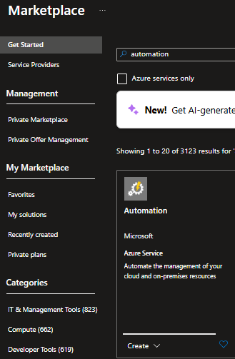

# MSFabricAutomation
This repository contains the process to execute Azure Automation Runbooks to do management activities over Microsoft Fabric Capacity

# Azure Automation Creation
**Step 1: Sign in to the Azure Portal**
1. Go to https://portal.azure.com.
2. Sign in with your Azure account.

**Step 2: Create the Automation Account**
1. In the search bar, type "Automation Accounts" and select the service.
2. Click “+ Create” or “+ Add”.




**Step 3: Fill in the Basic Information**
Provide the following details:
1. Subscription: Choose the subscription where you want to create the account.
2. Resource Group: Select an existing one or create a new one.
3. Automation Account Name: Must be unique within the resource group.
4. Region: Choose the region closest to your resources or users.

**Step 4: Additional Configuration (Optional but Recommended)** Enable Managed Identity:
1. Go to the Identity tab.
2. Enable the System-assigned managed identity so your Runbooks can securely access other Azure resources.

**Step 5: Review and Create**
1. Click “Review + create”.
2. Verify all the information.
3. Click “Create” to deploy the Automation Account.

**Step 6: Post-Creation** Once deployed, you sould:
1. Create Runbooks (PowerShell, Python, Graphical).
2. Import additional modules.
3. Configure credentials, certificates, variables, and connections.
4. Schedule tasks or integrate with alerts and events.

# Runtime Environment Creation

1. Go to "Process Automation" section and select "Runtime Environments"
2. Select Create, provide the following details:
3. Name: Must be unique.
4. Language: Choose the PowerShell
5. Runtime version: Choose 7.4 version.
6. select next to go Package section
7. In package section provide the following details:
8. Add from Galery
9. On search bar section write "Az.Accounts", then select the package and on the new page clikc on Select
10. Repeat again the process, select again Add from Galery
11. On search bar section write "Az.Fabric", then select the package and on the new page clikc on Select
12. For Az Package on package version select "None"
13. For Azure CLI Package on package version select "None"
14. Select Next for Review + Create section
15. Select Create

# Runbook Creation
1. Go to "Process Automation" section and select Runbooks
2. Select Create, provide the following details:
3. Runbook: select Create new.
4. Name: Must be unique.
5. Runbook Type: select PowerShell
6. Runtime Environment : Select from exiting option, then select the package created in the step before "Runtime Environment"
7. Select Review and create, then create

# Runbook Code
1. Go to "Process Automation" section and select Runbooks
2. Then select the Runbook in the previous step "Runbook creation"
3. On the Overview page select edit option and then select "Edit in portal"
4. On the Edit Portal Page, provide the following details:
5. Runtime Environment: Select the environment create in the step "Runtime Environment Creation"
6. on the coding section copy and paste the code provided:

```powershell
$AzureConnection = (Connect-AzAccount -Identity).context

Set-AzContext -SubscriptionName $AzureConnection.Subscription -DefaultProfile $AzureConnection

Suspend-AzFabricCapacity -ResourceGroupName "rgfabrictest" -CapacityName "demofabrictest2"
write-output "Suspend executed"
```

7. if you want to resumen the Fabric Capacity copy and paste the next code
```powershell
$AzureConnection = (Connect-AzAccount -Identity).context

Set-AzContext -SubscriptionName $AzureConnection.Subscription -DefaultProfile $AzureConnection

Resume-AzFabricCapacity -ResourceGroupName "rgfabrictest" -CapacityName "demofabrictest2"
write-output "Resume executed"
```

8. To test the runbook select "Test Pane" Option, and then press "Start"
9. The runbook will be executed , when it finished go to the error and warning section to validate this sections are clear.
10. After validate the proper execution, close this test pane page.
11. You will back to the Coding Page, select "Publish" option.

# Schedule creation
1. Go to Automation Account service
2. Go to Shared Resources section 
3. Select Schedules Option
4. On this page select "Add a schedule"
5. On schedule page provide the following details:
6. Name: must be unique
7. Starts: set the date and hour of first execution
8. Time zone: select the time zone acording your location
9. Recurrence: here you will find 2 options, select once to run just one time or Recurring for a periodically execution
10. Recur every: select the number of hours between each execution
11. Select Create

# Link Schedule with the run book
1. Go to Automation Account service
2. Go to Process Automatiion section 
3. Select the Runbook
4. On Runbook page go to "Resource" section
5. On Resource section go to "Schedules"
6. On Schedule page select "Add a schedule"
7. In the new page select "Schedule" , select the "Schedule" created in the previous step "Schedule creation" and the select OK
